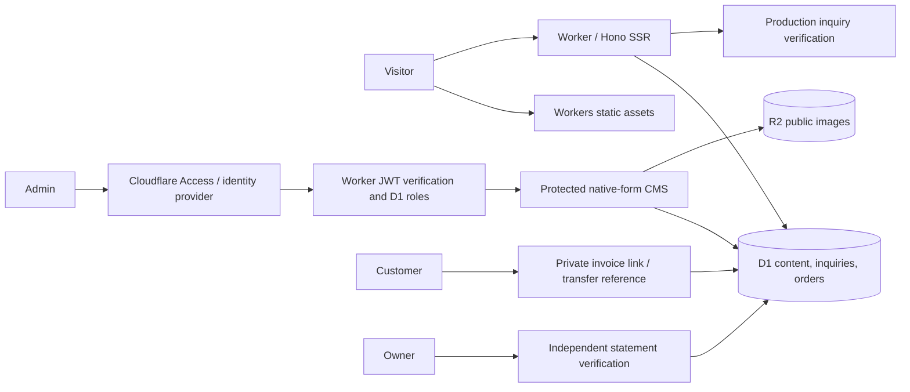

# Architecture and product direction

Controlex Media connects brand strategy, websites and digital growth for growing businesses in Pakistan and internationally. Content does not invent client outcomes, team size or guaranteed returns.

## Stack

Hono server JSX renders public pages and native admin forms directly on Cloudflare Workers. TypeScript, Zod and bounded form validators enforce input contracts. esbuild produces small browser/CSS assets; Wrangler emulates Workers, D1 and R2 locally. Production requires no Node server, VPS, Docker or external database. npm is a package manager/build runner, rather than the production hosting environment.

Hono was chosen for direct Workers APIs, little browser JavaScript and transparent SQL/security boundaries. Astro is a good editorial alternative; React SPA would need a separate public rendering strategy; Next.js would introduce adapter complexity and a larger application runtime without improving this native-form CMS workflow. See the original platform research for the comparison and dated limits.

Production service bindings and live credentials still require provisioning. Local password authentication is restricted to `ENVIRONMENT=local` and a loopback hostname; it cannot authenticate a deployed public origin.

## Information architecture

`/` contains hero, selected work, services, studio, process, packages, FAQs, optional published testimonials and inquiry CTA. `/work` is the full showcase. Every published service has `/services/:slug` and its own `/services/:slug/showcase`. `/work/:slug` contains the case study, galleries, context, outcome and optional live URL/testimonial. `/contact` stores verified inquiries; `/thank-you` is private/noindex. `/page/:slug`, `/insights` and `/insights/:slug` expose published CMS content. Published pages named `privacy` or `terms` replace the default development notices. Sitemap excludes drafts and private routes.

## Content and persistence

D1 stores users, services, projects, project-service associations, packages, testimonials, FAQs, socials, settings, pages, insights, media metadata, leads, orders, payment claims/events, content revisions, audit history and rate counters. Migrations evolve the schema without resetting state. Files live in R2, never as relational database blobs.

The CMS validates whitelisted resource fields and table names. SQL identifiers come from the registry and values are bound. JSX escapes authored text; arbitrary HTML/script blocks are not supported. Draft previews require authentication, are noindex and are never publicly cached. Resource edits use optimistic revisions; stale updates return 409, including project-service associations. Batch transactions link updates, revision snapshots and audit events. Archive hides content while preserving business records and references. Public media cannot be archived while content/branding refers to it.

## Authentication

Cloudflare Access JWT verification requires RS256 signatures against the team's JWKS, exact issuer/audience and required expiry/email/subject claims. Trusted signed identity is checked against an invited/active D1 account and its bound subject. A forged email header never grants access. Disabled accounts are checked on every request. Owners control identities/settings/finances; editors control content/media/inquiries. Production MFA/session lifetime belongs to the Access/IdP policy and must be configured during provisioning.

Local setup generates PBKDF2-SHA256 password hashes and signed, expiring local sessions in ignored environment files. These credentials are development-only. Authentication cookies use HttpOnly, SameSite Strict, HTTPS Secure and `__Host-` names where applicable. Admin mutations require exact-origin and cookie/form CSRF tokens. Login and inquiry controls limit attempts using atomic hashed-IP D1 counters. A daily scheduled job prunes rate windows older than a day. This is an MVP abuse boundary, not a guarantee against distributed attacks or quota exhaustion.

## Payments

Owners create invoices only after agreeing scope, amount and currency. Decimal PKR/USD entry converts to exact integer minor units. Orders freeze their package snapshot and price. A private 256-bit token exposes the invoice without disclosing customer email or studio notes. A customer transaction reference moves the order only to `awaiting_verification`; it never establishes payment.

Only an owner who independently verified the exact amount/currency in the business statement can mark an invoice paid. Provider references are unique, events and order transitions are atomic and replay is rejected. Full refunds require a separately verified outgoing reference; unpaid invoices can be cancelled. The application records these operations; it does not execute bank/wallet transfers. Merchant permissions, currencies, account instructions and legal/refund policies remain business prerequisites.

`payments/contracts.ts` defines the future automated adapter interface. No automatic checkout/webhook is exposed. An approved provider adapter must verify raw signed webhook bytes, timestamps, exact amount/currency/order and idempotency before activation. Browser redirects can never mark paid.

## Media, SEO and performance

Uploads require authenticated users, useful alt text, a 10 MB cap, file signatures and matching PNG/JPEG/WebP MIME types. SVG/HTML uploads are rejected. Random object keys prevent path injection. Browser resizing is a progressive enhancement, avoiding CPU-heavy image conversion on the Worker Free budget. Image delivery uses R2 streaming and `nosniff`.

SEO includes server HTML, per-content titles/descriptions, canonical URLs, OpenGraph/Twitter cards, uploaded project covers, published-content sitemap and robots rules. Organization JSON-LD contains only configured identity/URL/socials and uses the response CSP nonce. No invented addresses/review ratings. Clash Display is obtained directly from Fontshare; its unmodified binary is locally self-hosted and excluded from Git under vendor redistribution restrictions.

HTML and dynamic media are conservatively no-store for immediate publishing and draft isolation. Static assets have separate cache headers. Review production CPU/D1 read distributions before a traffic-heavy launch; local timings are not Cloudflare CPU measurements. Current lists are bounded to 200 items and should gain pagination when editorial volume approaches that bound.

## Remaining production prerequisites

The application is implemented and locally tested. Production still requires real D1/R2 bindings, Access team/audience and email allow policy, Turnstile keys, reviewed business/legal/contact/retention information, actual brand/client assets, approved payment accounts, backup/restore testing and a live staging check. No production readiness, resource provisioning, merchant approval or Windows execution is inferred from the local test results.

Domain renewal, gateway/FX fees and optional upgrades are separate costs. R2 free allowances can incur overages and may require billing activation. Workers/D1/Access eligibility and limits must be confirmed against the user's account before provisioning. None of those paid services is activated by committing these files.
