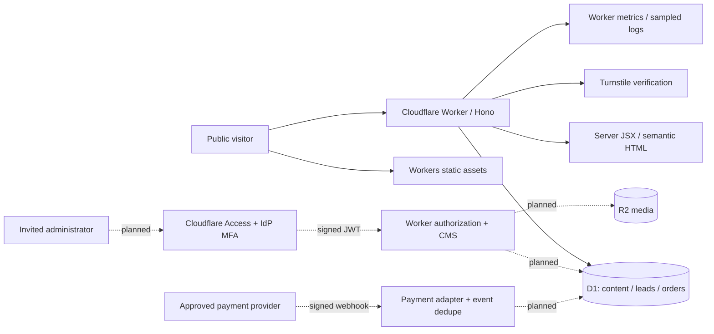

# Architecture and product direction

## Positioning

**A creative technology studio helping growing businesses make their next move.** Connect brand strategy, websites and digital growth, rather than selling disconnected tasks. Audience: owner-led businesses in Pakistan and international growth businesses. Tone: clear, thoughtful, confident. No unsupported claims about team size, client outcomes or guaranteed conversions.

## Site architecture

Home brings together selected work, services, studio, process, scoped packages, FAQ and a project CTA. Dedicated service and case-study URLs support clear intent and SEO. Contact collects a real brief. About and process can start as substantial homepage sections; create dedicated pages only when there is enough useful content. Privacy and terms need business/legal review. Insights/blog is deferred until there is a publishing strategy; schema is prepared but no empty blog is exposed.

Current routes: `/`, `/services/:slug`, `/work/:slug`, `/contact`, `/thank-you`, `/privacy`, `/terms`, `/sitemap.xml`, `/robots.txt`, `/api/health`, `/api/inquiries`. `/admin` and `/api/admin/*` deliberately return 503 until authentication and CMS are implemented. They are not a login demo.

## Stack evaluation

| Option | Fit | Tradeoff |
| --- | --- | --- |
| Hono + server JSX + small TypeScript enhancements | Chosen: direct Workers APIs, little browser JS, shared SSR/API validation, simple typed CRUD | Implement authoring and cache behavior explicitly; fewer built-in CMS primitives |
| Astro + Cloudflare adapter | Excellent editorial/portfolio rendering and optional islands | More machinery than needed for a server-driven admin in the same app; still a valid alternative |
| React SPA | Good interactive admin widgets | Public SEO requires SSR/prerender strategy; larger JS and separate APIs |
| Next.js / current Workers adapter | Extensive React features | Adapter complexity and current vinext beta unnecessary for this workflow; CPU/bundle costs need attention |

Hono, TypeScript, Zod, esbuild, Wrangler, D1 SQL migrations. No Node server, Docker, VPS, ORM, paid animation package or external hosted database. Native HTML forms, details, and links work without browser JavaScript.

## Diagram



Solid paths represent Phase 1 capabilities; dotted paths are planned, not implemented. Production Turnstile still requires actual keys and hostname configuration.

## Data and CMS

Tables: users, pages, services, projects, project_services, packages, testimonials, FAQs, social_links, settings, media, leads, orders, payment_events, posts, audit_log, rate_limits. `0001_foundation.sql` creates constraints and indexes; `0002_studio_content.sql` seeds honest reviewable starter content. Future migrations evolve schema without resetting content.

CMS planned as protected server-rendered application with reusable list/editor components and bounded typed forms. Dashboard → content lists → edit/preview → draft/publish/archive. Support per-resource ordering, status, SEO and timestamps. Settings manage homepage copy/sections, contact details, navigation/footer and branding. Media stores object keys and metadata in D1 and bytes in R2. Active ordered social profiles come from D1; there are no hardcoded handles.

CMS mutations will validate allowed block types and field lengths; arbitrary HTML or script blocks are not permitted. Render text through JSX escaping. Draft preview must be authenticated/no-store and must never leak through public caches. Use optimistic revision checks for edits, batch operations for audit logging, and archive referenced records instead of deleting them. Do not claim these editor flows exist in Phase 1.

## Authentication and security

Planned Access policy allowlists invited identities and requires the selected identity provider. In-Worker JWT verification checks signature via JWKS, algorithm, issuer, audience and expiry. D1 user status/role supplies authorization; email headers alone are never trusted. Enforce protection even on alternate Worker hostnames. Access-managed secure sessions avoid storing/hashing passwords in Workers. Confirm Access free plan eligibility; otherwise select a vetted hosted identity provider before building auth. No public admin registration.

All mutations must require same-origin requests; admin flows will add session-bound CSRF tokens. Phase 1 inquiry endpoint requires the Origin header to exactly match request origin, enforces a streamed 64 KB body cap, Zod validation, a honeypot, five attempts per hashed IP per ten-minute window, and production Turnstile hostname/action verification. SQL uses bound parameters. CSP restricts scripts, frames, form actions, objects and connection destinations; secure headers apply to Worker responses. Static assets receive headers using `_headers`.

Production rate limits use the Cloudflare-supplied network address header; local requests share a local bucket unless testing supplies distinct synthetic addresses. D1 atomic upsert avoids lost increments. This is a small MVP abuse control, not a guarantee against distributed spam or D1 quota exhaustion. Review WAF/edge rate limiting availability and production usage before scaling. No lead data or secret values are logged.

## Payments

All displayed monetary values store **integer minor units** plus `PKR` or `USD`; do not sum or convert currencies implicitly. A quote can create a frozen package/order snapshot. Pricing and currency must be loaded server-side, never accepted from checkout input.

Provider interface in `src/payments/contracts.ts` is a contract only, not working payment processing. Modes: inquiry, manual invoice, approved automated checkout. PKR bank/Easypaisa/JazzCash invoice receipts require independent merchant statement/reconciliation by an authorized owner; USD Payoneer invoicing requires provider permission and account eligibility. No fake payment status or client confirmation screen is exposed.

Automatic path: select package → server loads price and creates pending order → adapter creates hosted checkout → signed server webhook verified over raw request bytes → verify exact amount/currency/order reference → dedupe `(provider,event_id)` → atomic state transition/payment event → confirmation. Browser redirects never mark an order paid. Handle retries, out-of-order events, refunds, failures and reconciliation; protect webhook signature timestamps/replay. Never expose credentials or process card details locally.

## Media, performance and SEO

Original Phase 1 artwork uses CSS/vector shapes, so there are no third-party stock assets. Future uploads: authenticated/authorized upload, 10 MB cap, MIME and file signature validation, reject SVG/HTML executable uploads, require useful alt text, safe random object keys, and R2 public delivery through the Worker. Optimize/resample on the uploader device or before upload; do not promise unlimited free Cloudflare Images transformations or CPU-heavy image processing in a 10 ms Worker. Portfolio media will use responsive variants, dimension attributes, lazy loading below the fold and one carefully sized hero asset if needed.

Public content is server-rendered and includes page metadata, canonical URLs, OpenGraph/Twitter cards, sitemap and robots. Phase 1 uses no-store HTML while schema/content workflows are evolving. Before launch, add versioned content caching/invalidation after publish, verify cache isolation, and implement validated organization/service JSON-LD after legal/business details are known. Do not invent structured-data addresses or reviews.

## Services and costs

Required for local Phase 1: none outside installed dependencies. Required for deployment: Cloudflare Workers/D1 and Turnstile. Later: Access + identity provider, R2 for CMS uploads, approved merchant provider. KV, Durable Objects, Queues, hosted database/auth and notification email services are optional; none are provisioned.

Cloudflare usage can stay at $0 within free caps, but this is not an unconditional cost guarantee. Domain renewal is separate. R2 overages, a Workers upgrade, identity seats, image transformation products, payment/FX fees and optional email delivery may cost money. No services or billing plans are activated by this repository.

## Decisions needed before later stages

Confirmed: Pakistan operations; PKR and USD; local wallets, bank and Payoneer preference; growing-business audience.

Before implementation of the corresponding stage: legal entity and registration status; existing merchant/business accounts and approval; actual domain and inquiry/privacy email; invited admin email addresses/IdP/MFA; rights-cleared client projects and testimonials; approved scopes/prices/deposit/refund policy; retention/privacy requirements; licensed Clash Display files. These do not block a local foundation. Do not request secret values in chat: add them through provider/Cloudflare environment settings.

## Delivery stages

1. **Current:** research, architecture, original design foundation, SSR site, D1 schema and inquiry intake.
2. Authentication + CMS dashboard, CRUD, ordering, publish/archive, settings/socials/SEO; meaningful authorization/CSRF tests.
3. Media uploads, full public content, previews and cache invalidation, actual brand font, complete reviewed legal content.
4. Approved payment adapter or reviewed manual invoice workflow; order/admin controls, webhook/replay/reconciliation tests.
5. Accessibility/performance audit, backup/restore exercise, production resource provisioning, staging and domain deployment after explicit deployment authorization.

Validate each stage and give the owner a chance to test before moving into the next. No production-ready claim until the remaining stages are implemented and verified.

## Repository structure

```text
controlex-media/
├── src/
│   ├── index.tsx              # Worker routes and middleware
│   ├── types.ts               # Bindings and domain records
│   ├── data/content.ts        # Published-content queries
│   ├── security/inquiry.ts    # Validation, Turnstile and abuse controls
│   ├── payments/contracts.ts  # Provider interface only
│   ├── views/                 # SSR layout, homepage and contact components
│   ├── styles/site.css        # Design tokens and responsive components
│   └── client.ts              # Progressive enhancement
├── migrations/               # Schema and starter content
├── public/                   # Original favicon/share image and asset headers
├── scripts/                  # Builds, Wrangler wrapper, deploy preflight
├── tests/                    # Security, SQL, runtime and browser checks
├── docs/                     # Research, architecture, design, deployment, evidence
├── wrangler.jsonc            # Separate local and production bindings
├── package.json
└── package-lock.json
```

Next-stage modules will add `src/admin/`, `src/security/access.ts`, `src/media/`, and `src/payments/providers/` as real features are implemented; empty placeholder applications are not created.
